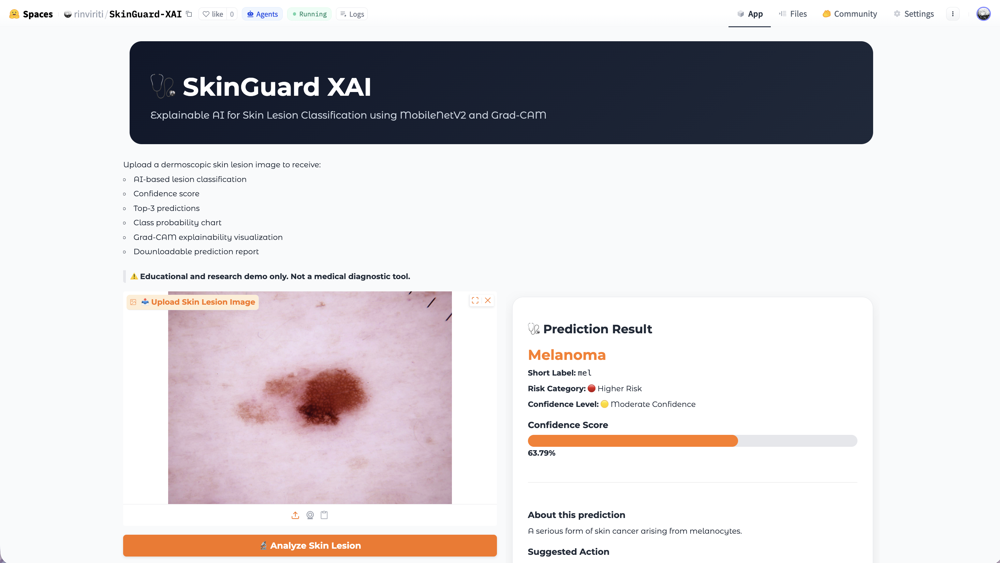
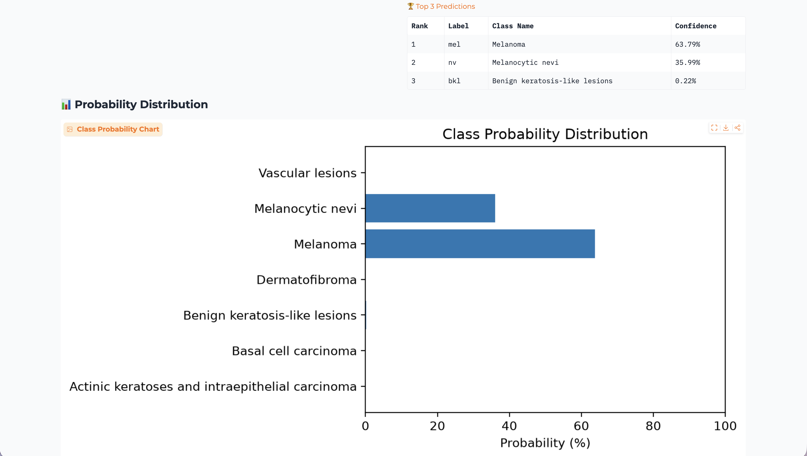
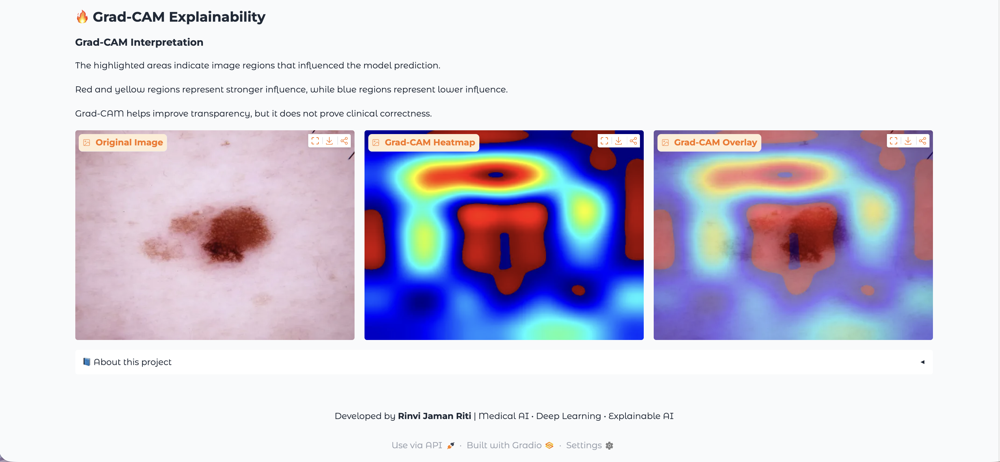
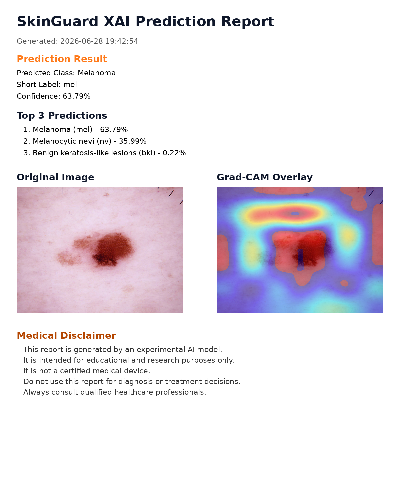

# 🩺 SkinGuard XAI

<p align="center">


</p>

An end-to-end **Explainable Artificial Intelligence (XAI)** system for automated skin lesion classification using **Transfer Learning**, **MobileNetV2**, and **Grad-CAM**.

The project demonstrates a complete Medical AI workflow from data preprocessing and model training to explainable inference and cloud deployment using **Gradio** and **Hugging Face Spaces**.

---

# 🌐 Live Demo

## 🚀 Try SkinGuard XAI

👉 **https://huggingface.co/spaces/rinviriti/SkinGuard-XAI**

---

# 🎥 Application Demo

<p align="center">

</p>

---

# 📸 Screenshots

## 🏠 Home Interface

<p align="center">

</p>

---

## 🩺 Prediction Result

<p align="center">

</p>

---

## 🔥 Grad-CAM Explainability

<p align="center">

</p>

---

## 📄 Downloadable AI Report

<p align="center">

</p>

---

# 🚀 Project Features

✅ Skin lesion classification using MobileNetV2

✅ Transfer Learning

✅ HAM10000 Dataset

✅ Explainable AI using Grad-CAM

✅ Top-3 Prediction Ranking

✅ Confidence Score Visualization

✅ Probability Distribution Chart

✅ Downloadable AI Prediction Report

✅ Gradio Web Application

✅ Hugging Face Deployment

---

# 🧠 Model Pipeline

```text
HAM10000 Dataset
        │
        ▼
Image Preprocessing
        │
        ▼
Transfer Learning (MobileNetV2)
        │
        ▼
Skin Lesion Classification
        │
        ▼
Top-3 Predictions
        │
        ▼
Grad-CAM Explainability
        │
        ▼
Gradio Interface
        │
        ▼
Hugging Face Deployment
```

---

# 📂 Repository Structure

```text
01_SkinGuard_XAI/

├── model/
│   ├── SkinGuard_XAI_Image_Model.keras
│   ├── SkinGuard_XAI_Metadata_Fusion_Model.keras
│   ├── class_names.json
│   └── metadata_columns.json
│
├── outputs/
│   ├── gradcam_result.png
│   ├── inference_prediction.csv
│   └── prediction_report.png
│
├── screenshots/
│   ├── demo.gif
│   ├── home.png
│   ├── prediction.png
│   ├── gradcam.png
│   └── report.png
│
├── SkinGuard_XAI.ipynb
├── SkinGuard_XAI_Inference.ipynb
├── app.py
├── utils.py
├── requirements.txt
└── README.md
```

---

# 🗂 Dataset

**HAM10000 – Human Against Machine with 10000 Training Images**

- 10,015 dermoscopic skin lesion images
- Seven diagnostic categories
- Public benchmark dataset for skin lesion classification

Dataset:
https://www.kaggle.com/datasets/kmader/skin-cancer-mnist-ham10000

---

# 🛠 Technologies Used

| Category | Technology |
|-----------|------------|
| Language | Python |
| Framework | TensorFlow / Keras |
| Model | MobileNetV2 |
| Explainability | Grad-CAM |
| Image Processing | OpenCV |
| Data Analysis | Pandas, NumPy |
| Visualization | Matplotlib |
| Deployment | Gradio |
| Hosting | Hugging Face Spaces |

---

# 📈 Output

The deployed application provides:

- Predicted skin lesion class
- Confidence score
- Top-3 predictions
- Class probability distribution
- Grad-CAM heatmap
- Grad-CAM overlay visualization
- Downloadable AI-generated prediction report

---

# ⚠ Disclaimer

This application is developed **for educational and research purposes only**.

It is **not a certified medical device** and **must not be used for clinical diagnosis or treatment decisions**.

Always consult qualified healthcare professionals for medical advice.

---

# 👩‍💻 Developer

**Rinvi Jaman Riti**

Artificial Intelligence • Medical AI • Deep Learning • Computer Vision

GitHub:
https://github.com/rinviriti

Hugging Face:
https://huggingface.co/rinviriti

---

## ⭐ If you found this project helpful, please consider giving it a star!
