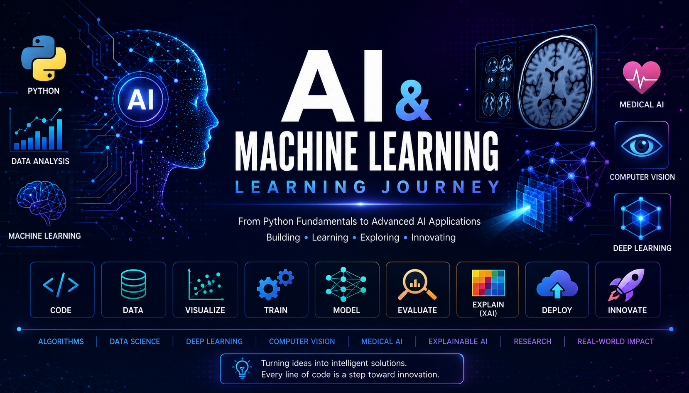

# 🤖 AI & Machine Learning Learning Journey

<p align="center">
    
</p>

<p align="center">


</p>

A comprehensive portfolio documenting my journey from **Python fundamentals** to **advanced Artificial Intelligence applications** through hands-on coding, real-world projects, research-oriented implementations, and deployment.

This repository showcases practical implementations in **Machine Learning**, **Deep Learning**, **Computer Vision**, and **Medical AI**, while demonstrating a structured learning path toward building production-ready AI systems.

---

# 🎯 Objective

The goal of this repository is to build a strong practical foundation in Artificial Intelligence by:

- Developing projects from scratch
- Implementing Machine Learning and Deep Learning models
- Exploring modern Computer Vision techniques
- Applying Explainable AI (XAI)
- Deploying AI applications to the cloud
- Following research-oriented development practices

---

# 📊 Repository at a Glance

| Metric | Value |
|---------|------:|
| 📚 Learning Modules | 12 |
| 📒 Jupyter Notebooks | 70+ |
| 🤖 Machine Learning Models | 10+ |
| 🧠 Deep Learning Projects | Multiple |
| 🌐 Deployed AI Applications | 1 |
| 🔬 Medical AI Projects | Growing |

---

# 🛣️ Learning Roadmap

| Module | Topic | Status |
|------|-------------------------------|:------:|
| 01 | Python Fundamentals | ✅ |
| 02 | Functions | ✅ |
| 03 | Data Structures | ✅ |
| 04 | File Handling | ✅ |
| 05 | Object-Oriented Programming | ✅ |
| 06 | NumPy & Pandas | ✅ |
| 07 | Data Visualization | ✅ |
| 08 | Machine Learning | ✅ |
| 09 | Deep Learning | ✅ |
| 10 | Computer Vision | ✅ |
| 11 | Medical AI | 🚧 |
| 12 | AI Capstone Projects | 🚧 |

---

# 🛠️ Tech Stack

<p>


</p>

---

# 📚 What You'll Learn

Throughout this repository, I implement and explore:

- Python Programming
- Data Structures & Algorithms
- Data Analysis & Preprocessing
- Feature Engineering
- Machine Learning Algorithms
- Deep Learning
- Neural Networks
- Transfer Learning
- Computer Vision
- Medical Image Analysis
- Explainable AI (Grad-CAM)
- Model Evaluation
- AI Deployment
- Research-Oriented AI Workflows

---

# ⭐ Featured Capstone Project

## 🩺 SkinGuard XAI

An end-to-end **Explainable Artificial Intelligence (XAI)** system for automated skin lesion classification using **Transfer Learning**, **MobileNetV2**, and **Grad-CAM**.

### Highlights

- MobileNetV2 Transfer Learning
- HAM10000 Dataset
- Explainable AI using Grad-CAM
- Top-3 Prediction Ranking
- Confidence Score Visualization
- Probability Distribution Chart
- Downloadable AI Report
- Interactive Gradio Web Application
- Hugging Face Deployment

🌐 **Live Demo**

https://huggingface.co/spaces/rinviriti/SkinGuard-XAI

📁 **Project**

```
12_capstone_projects/01_SkinGuard_XAI
```

---

# 📂 Repository Structure

```text
AI-ML-Learning-Journey/
│
├── 01_python_fundamentals/
├── 02_functions/
├── 03_data_structures/
├── 04_file_handling/
├── 05_oop/
├── 06_numpy_pandas/
├── 07_data_visualization/
├── 08_machine_learning/
├── 09_deep_learning/
├── 10_computer_vision/
├── 11_medical_ai/
├── 12_capstone_projects/
│     └── 01_SkinGuard_XAI/
│
└── README.md
```

---

# 🚀 AI Development Workflow

```text
Python Fundamentals
        │
        ▼
Data Analysis
        │
        ▼
Machine Learning
        │
        ▼
Deep Learning
        │
        ▼
Computer Vision
        │
        ▼
Medical AI
        │
        ▼
Explainable AI (XAI)
        │
        ▼
Deployment
        │
        ▼
Research-Oriented Projects
```

---

# 📈 Repository Highlights

- ✅ Structured AI Learning Roadmap
- ✅ 70+ Interactive Jupyter Notebooks
- ✅ Machine Learning Implementations
- ✅ Deep Learning Projects
- ✅ Computer Vision Applications
- ✅ Medical AI Projects
- ✅ Explainable AI (Grad-CAM)
- ✅ Cloud Deployment with Gradio & Hugging Face
- ✅ Research-Oriented Development

---

# 🎯 Current Focus

- Medical Image Analysis
- Explainable AI (XAI)
- Transfer Learning
- TensorFlow & Keras
- Computer Vision
- End-to-End AI Deployment
- Research-Driven Deep Learning

---

# 📊 GitHub Statistics

<p align="center">


</p>

---

# 🌱 Continuous Learning

Artificial Intelligence is constantly evolving, and this repository evolves with it.

As I continue learning, I will expand this portfolio with:

- End-to-End AI Applications
- Medical AI Systems
- Computer Vision Projects
- Explainable AI Implementations
- Research-Based Deep Learning Models
- Production-Ready AI Deployments

Every project in this repository reflects my commitment to continuous learning, practical implementation, and research-driven software development.

---

## ⭐ If you find this repository useful, consider giving it a star!
